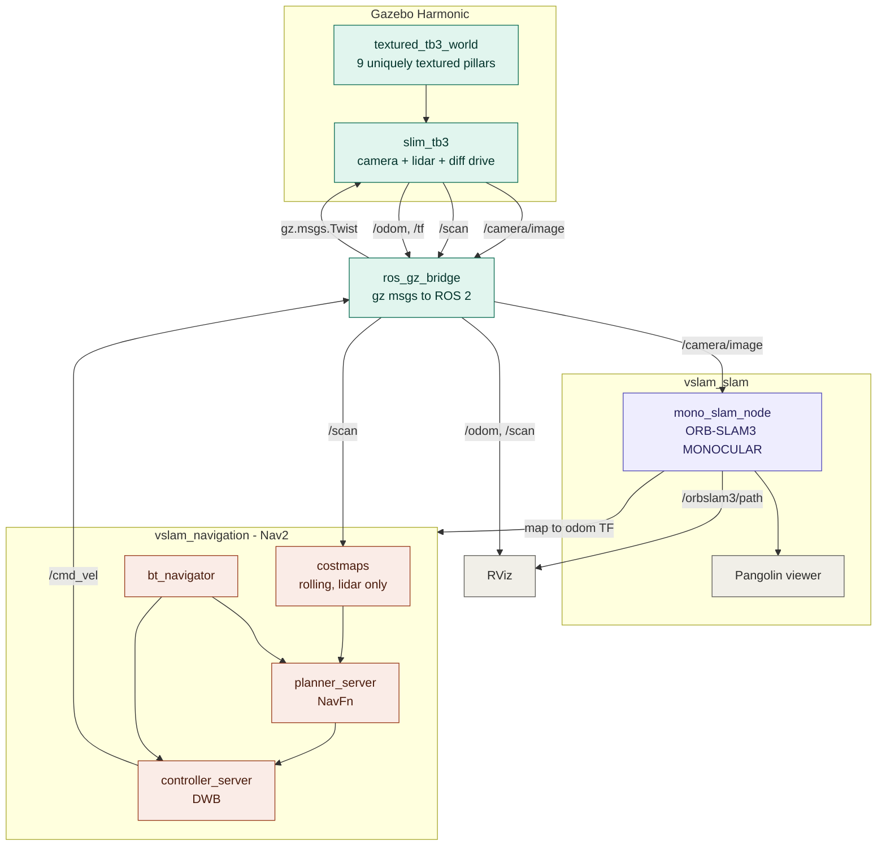
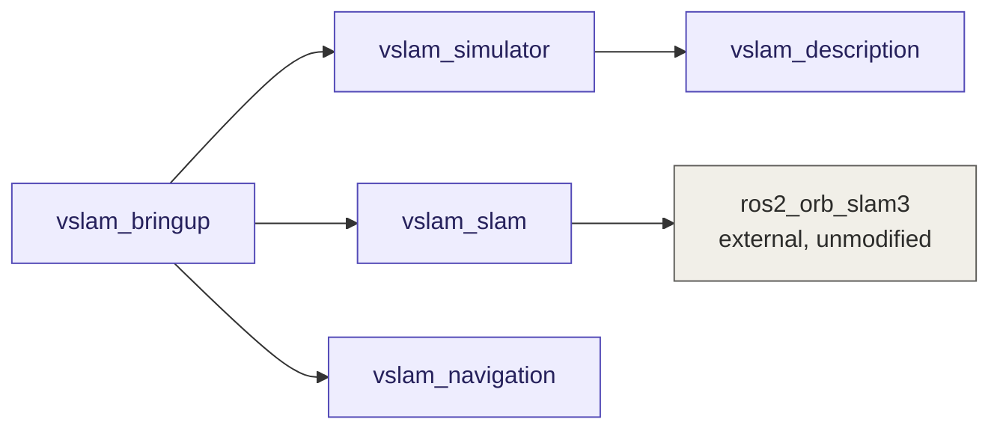
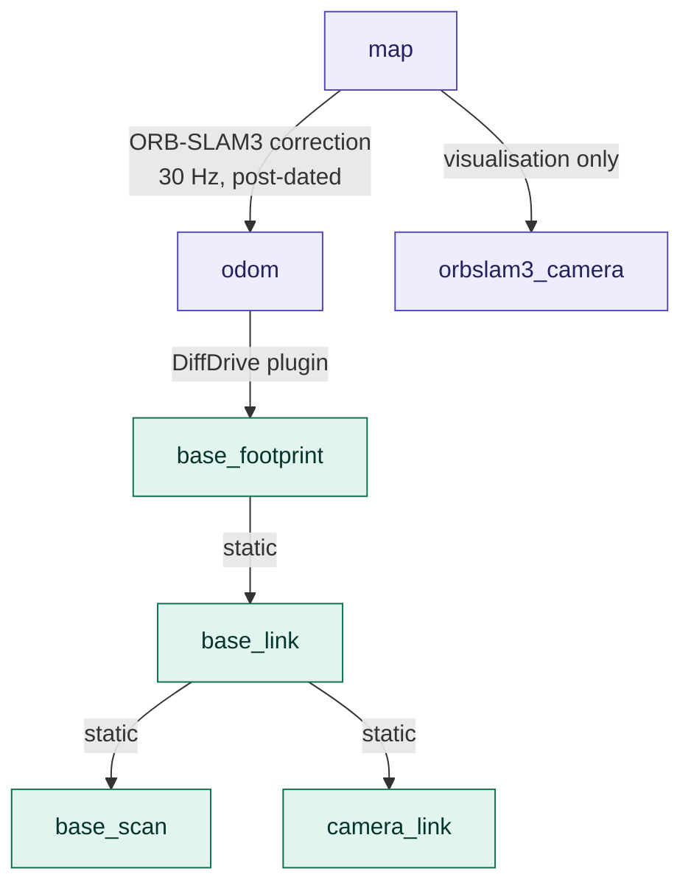
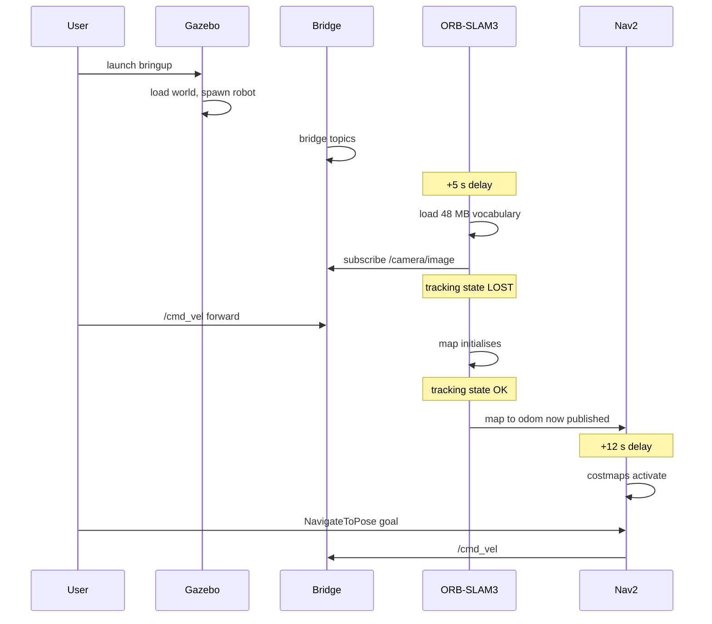
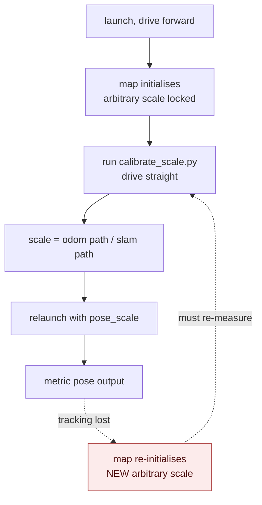
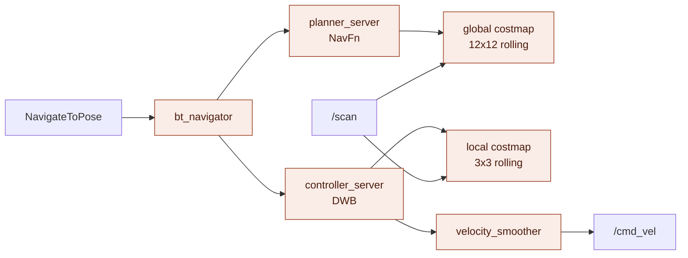

# orbslam3-nav2-sim

Autonomous navigation driven by **monocular visual SLAM**. A slim TurtleBot3
localises itself with ORB-SLAM3 from a single RGB camera — no AMCL, no prebuilt
map — and Nav2 plans and drives on top of that estimate.

**ROS 2 Jazzy** · **Gazebo Harmonic** (gz-sim 8.14) · **Ubuntu 24.04**

---

## Architecture



The loop that matters: **camera → ORB-SLAM3 → `map→odom` → Nav2 → `/cmd_vel` → robot**.
The lidar never touches SLAM; it only fills obstacle costmaps. Vision alone
answers "where am I".

---

## Packages

| Package | Role | Mirrors `glitch-amr` |
|---|---|---|
| `vslam_description` | Robot xacro, cut Burger mesh, RViz config | `glitch_description` |
| `vslam_simulator` | Textured world, Gazebo launch, bridge config, static TFs | `glitch_simulator` |
| `vslam_slam` | ORB-SLAM3 node, camera settings, scale calibration | `glitch_nodes` |
| `vslam_navigation` | Nav2 params and launch | `glitch_navigation` |
| `vslam_bringup` | Top-level launch composing everything | `glitch_bringup` |



Only `bringup_sim.launch.py` is meant to be run directly. It includes the
per-package launch files rather than declaring nodes itself.

---

## Quick start

```bash
ros2 launch vslam_bringup bringup_sim.launch.py
```

Then **drive forward**. Monocular SLAM initialises from *translation* — pure
rotation will never converge:

```bash
ros2 topic pub -r 10 /cmd_vel geometry_msgs/msg/Twist '{linear: {x: 0.08}}'
```

With autonomous navigation:

```bash
ros2 launch vslam_bringup bringup_sim.launch.py nav:=true
```

### Launch arguments

| Argument | Default | Meaning |
|---|---|---|
| `gui` | `true` | Gazebo GUI; `false` runs headless |
| `rviz` | `true` | Start RViz with the SLAM config |
| `slam` | `true` | Start ORB-SLAM3 |
| `nav` | `false` | Start Nav2 (delayed 12 s) |
| `show_viewer` | `true` | ORB-SLAM3's own Pangolin window |
| `pose_scale` | `3.2068` | Monocular scale factor |

---

## Setup

### Dependencies

```bash
sudo apt install -y wayland-protocols libegl1-mesa-dev libc++-dev libepoxy-dev \
                    ros-jazzy-turtlebot3-gazebo ros-jazzy-nav2-bringup
```

### Pangolin

Not packaged for 24.04. **v0.9.5 is verified working** against this ORB-SLAM3 —
no source patches needed.

```bash
cd ~/src && git clone --branch v0.9.5 --depth 1 https://github.com/stevenlovegrove/Pangolin.git
cd Pangolin && cmake -B build -GNinja -DCMAKE_BUILD_TYPE=Release \
  -DCMAKE_INSTALL_PREFIX=$HOME/.local -DBUILD_TESTS=OFF -DBUILD_EXAMPLES=OFF
cmake --build build -j12 && cmake --install build
```

Installing to `~/.local` avoids sudo but bakes no RPATH, so `~/.local/lib` must
be on `LD_LIBRARY_PATH`. `slam.launch.py` sets this itself; without it the node
dies with **exit 127** (`libpango_display.so.0` not found). To remove the
workaround entirely:

```bash
echo "$HOME/.local/lib" | sudo tee /etc/ld.so.conf.d/pangolin.conf && sudo ldconfig
```

### ORB-SLAM3

From [`Mechazo11/ros2_orb_slam3`](https://github.com/Mechazo11/ros2_orb_slam3),
**`jazzy` branch**. It must live at `~/ros2_ws/src/ros2_orb_slam3` — its
`common.cpp` hardcodes `packagePath = "ros2_ws/src/ros2_orb_slam3/"`.

```bash
mkdir -p ~/ros2_ws/src && cd ~/ros2_ws/src
git clone --branch jazzy https://github.com/Mechazo11/ros2_orb_slam3.git
ln -s /path/to/orbslam3-nav2-sim ~/ros2_ws/src/orbslam3-nav2-sim
cd ~/ros2_ws && colcon build --symlink-install \
  --cmake-args -DCMAKE_PREFIX_PATH=$HOME/.local -DCMAKE_BUILD_TYPE=Release
```

**Nothing in `ros2_orb_slam3` is modified.** `vslam_slam` links its
`liborb_slam3_lib.so` and drives ORB-SLAM3 directly. Upstream's `mono_node_cpp`
is fed by a Python String handshake and publishes no pose at all, so it was
replaced rather than patched.

---

## The robot

TurtleBot3 Burger with the upper two decks cut off, a forward monocular camera
on an L-bracket, and the LDS lidar raised on a post. Geometry follows the
official ROBOTIS burger model rather than being re-derived.

```
        lidar (base_scan)  z = 0.150
              ▲
              │ post
     camera ──┤            z = 0.115   x = +0.032
              │
        ══════╧══════      deck top    z = 0.060
        │  burger base │
        └──○────────○──┘   wheels      z = 0.023   y = ±0.080
              caster       x = -0.081
```

| | Value | Notes |
|---|---|---|
| Body | `0.138 × 0.138 × 0.066` | Burger base plate, mesh cut at z=62 mm |
| Wheels | `y = ±0.080`, radius `0.033` | matches real Burger |
| `wheel_separation` | `0.160` | **must** equal `2 × wheel_y` |
| Max speed | `0.22 m/s`, `2.84 rad/s` | real Burger limits |
| Camera | 480×480 @ 30 Hz, `hfov 1.047` | at `z=0.115`, centred |
| Intrinsics | `fx = fy = 415.787`, `cx = cy = 240` | zero distortion |
| Lidar | 360 samples, 0.12–3.5 m, 10 Hz | at `z=0.150` |

**Two constraints that cause silent failures:**

`wheel_separation` must match the wheel joint poses. If they disagree, odometry
reports the wrong rotation with no visible symptom. Verified: 1.54 % yaw error
against ground truth over a 200° turn — a wrong separation would show ~79 %.

Intrinsics are **measured** from `/camera/camera_info`, not computed from the FOV
formula (which gives 415.69, off by 0.1). They live in two files and must stay in
sync: `gz_slim_tb3.sdf.xacro` and `vslam_slam/config/tb3.yaml`.

The lidar sits **above** the camera bracket (top at `z=0.119`). Mounted lower,
the bracket appears in the scan and blinds the robot forward.

---

## TF tree



There is **no `robot_state_publisher`** — it requires URDF and this robot is
described in SDF. The `base_footprint → base_link → base_scan / camera_link`
transforms are published as static transforms in `sim.launch.py` and must be kept
in sync with the xacro joint poses.

`map → odom` is a *correction* on wheel odometry, not the robot pose:

```
map→odom = map→camera × (base→camera)⁻¹ × (odom→base)⁻¹
```

Publishing `map → base_footprint` directly would give `base_footprint` two
parents and fight the DiffDrive plugin.

---

## Startup sequence



The delays are load-bearing. SLAM waits for Gazebo; Nav2 waits for SLAM. **Nav2
cannot localise until you drive forward and the map initialises.**

---

## Topics

| Topic | Type | Direction | Rate |
|---|---|---|---|
| `/camera/image` | `sensor_msgs/Image` | Gazebo → ROS | 30 Hz |
| `/camera/camera_info` | `sensor_msgs/CameraInfo` | Gazebo → ROS | 30 Hz |
| `/scan` | `sensor_msgs/LaserScan` | Gazebo → ROS | 10 Hz |
| `/odom` | `nav_msgs/Odometry` | Gazebo → ROS | 30 Hz |
| `/imu` | `sensor_msgs/Imu` | Gazebo → ROS | 200 Hz |
| `/joint_states` | `sensor_msgs/JointState` | Gazebo → ROS | 30 Hz |
| `/clock` | `rosgraph_msgs/Clock` | Gazebo → ROS | — |
| `/cmd_vel` | `geometry_msgs/Twist` | ROS → Gazebo | — |
| `/orbslam3/pose` | `nav_msgs/Odometry` | ORB-SLAM3 | on tracked frames |
| `/orbslam3/path` | `nav_msgs/Path` | ORB-SLAM3 | on tracked frames |

`/odom` is simulator ground truth — used for scale calibration and as an RViz
comparison, never as Nav2's localisation source.

---

## Monocular scale

Monocular SLAM has **no metric scale**. ORB-SLAM3's units are arbitrary and fixed
at map initialisation.



```bash
ros2 run vslam_slam calibrate_scale.py
# drive straight in another terminal while it samples:
ros2 topic pub -r 10 /cmd_vel geometry_msgs/msg/Twist '{linear: {x: 0.09}}'
```

Measured at **3.2068** in `textured_tb3_world` (odom 1.1343 m vs SLAM 0.3537
units). The script sums path segments rather than endpoint distance — measuring
endpoints underestimates any curved path.

**The value is only valid for the map it was measured on.** The dashed loop above
is the real operational cost of monocular SLAM.

---

## Nav2

```bash
ros2 launch vslam_bringup bringup_sim.launch.py nav:=true
```

Drive forward to initialise SLAM, then send goals from RViz's **2D Goal Pose**, or:

```bash
ros2 action send_goal /navigate_to_pose nav2_msgs/action/NavigateToPose \
  "{pose: {header: {stamp: {sec: 0, nanosec: 0}, frame_id: map}, pose: {position: {x: 0.8, y: 0.0}, orientation: {w: 1.0}}}}"
```



The **zero stamp matters**. A stamped goal pins the planner to one instant; once
the TF buffer moves past it, every lookup fails with *"extrapolation into the
past"* and the goal ABORTS. Zero means "latest".

### Seeing the planning

With `nav:=true`, RViz loads `nav.rviz` instead of `slam.rviz`, adding everything
the planner produces:

| Display | Topic | Colour |
|---|---|---|
| Global plan | `/plan` | green |
| Local plan (DWB trajectory) | `/local_plan` | yellow |
| Global costmap | `/global_costmap/costmap` | costmap scheme |
| Local costmap | `/local_costmap/costmap` | costmap scheme |
| Footprint | `/local_costmap/published_footprint` | cyan |
| Lidar | `/scan` | white points |
| SLAM trajectory | `/orbslam3/path` | violet |
| Ground truth | `/odom` | orange arrows |

It also loads the **Navigation 2 panel** and the **GoalTool**, so you can click
"Nav2 Goal" in the toolbar and set targets directly in the 3D view.

Measured on a live goal: `/plan` carried **60 poses**, `/local_plan` **6**.

Inspect the plans from the terminal instead:

```bash
ros2 topic echo /plan --once            # global NavFn path
ros2 topic echo /local_plan --once      # DWB rollout
ros2 topic hz /global_costmap/costmap
```

### Swapping the planner

`NavFn` (Dijkstra/A*) is the default. Also installed: `nav2_smac_planner`
(2D, hybrid-A*, lattice) and `nav2_theta_star_planner`. Change
`planner_server.GridBased.plugin` in `vslam_navigation/config/nav2_params.yaml`:

```yaml
GridBased:
  plugin: "nav2_smac_planner::SmacPlannerHybrid"   # feasible curved paths
  # plugin: "nav2_theta_star_planner::ThetaStarPlanner"  # any-angle, fewer waypoints
```

`NavfnPlanner` ignores robot kinematics and produces grid-aligned paths;
Hybrid-A* respects the turning radius, which matters more on larger robots than
this one.

Two deliberate differences from a stock TurtleBot3 Nav2 config:

- **No AMCL, no map_server.** ORB-SLAM3 publishes `map → odom`, so visual SLAM
  replaces particle-filter-on-a-prebuilt-map. That is the point of the project.
- **No static layer.** There is no prebuilt occupancy grid, so both costmaps are
  rolling windows populated purely by the lidar.

Footprint is `robot_radius: 0.11` — the body is 0.138 wide, but the wheels reach
`y = ±0.089`.

**Verified:** two `NavigateToPose` goals SUCCEEDED, reaching within 0.13 m and
0.23 m of target.

---

## The world

`textured_tb3_world.sdf` keeps the TurtleBot3 layout — 9 pillars on a ±1.1 m
grid — inside a 5×5 m walled arena.

Two departures from the stock world, both deliberate:

**Pillars are cylinders, not `hexagon.dae`.** The mesh has no reliable UVs, so
albedo maps would not apply to it.

**Every pillar is textured differently.** Nine identical pillars cause perceptual
aliasing: DBoW2 place recognition matches the wrong one and corrupts the map.
Each texture carries 679–2157 ORB features; the rendered camera view measures
**1682 features per frame**, against ORB-SLAM3's 1000/frame default.

Regenerate textures with:

```bash
python3 vslam_simulator/scripts/make_textures.py vslam_simulator/materials/textures
python3 vslam_simulator/scripts/make_textures.py demo   # self-check
```

The self-check asserts on **ORB feature count**, not pixel variance — a texture
can look busy to a human and still be nearly invisible to the detector.

---

## Troubleshooting

| Symptom | Cause | Fix |
|---|---|---|
| `exit code 127`, `libpango_display.so.0 not found` | Pangolin in `~/.local`, no RPATH | Launch file sets `LD_LIBRARY_PATH`; or run `ldconfig` step above |
| Robot renders invisible | `meshes/` not installed | `install(DIRECTORY urdf meshes rviz ...)` in CMakeLists |
| Goal ABORTS, `extrapolation into the past` | Goal carried a real timestamp | Send with `stamp: {sec: 0, nanosec: 0}` |
| SLAM never initialises | Rotating, not translating | Drive **straight** first |
| `tracking lost` near walls | Too few features in view | Drive gently, stay off walls |
| Nav2 costmaps empty | `map → odom` missing | Drive forward until SLAM tracks |
| Trajectory drives sideways / into floor | Optical→ROS rotation skipped | See `publishPose()` |
| Odometry distance wrong, no other symptom | `wheel_separation` ≠ 2 × wheel_y | Change both together |
| Stale sim behaviour after edits | Old `gz sim` server still holding the world | `pkill -f 'gz[ ]sim'` |

---

## Known limits

**Monocular tracking is the weak link.** It drops on fast rotation, featureless
views, and near walls. Every recovery re-initialises the map with a new arbitrary
scale, silently invalidating `pose_scale` and degrading Nav2's localisation.

**The fix is already half-built.** The robot has a simulated IMU publishing at
200 Hz and already bridged to `/imu` — entirely unused. Switching ORB-SLAM3 to
`IMU_MONOCULAR` would give metrically-scaled output, deleting the scale
calibration step and its whole failure mode, plus far more robust tracking
through rotation. It needs IMU measurements passed to `TrackMonocular`,
camera-IMU extrinsics (`Tbc`) and noise parameters in the yaml, and an
initialisation phase requiring motion excitation.

**No map persistence.** `System.LoadAtlasFromFile` / `SaveAtlasToFile` are
commented out, so every run starts from scratch.

**Map points are not published.** ORB-SLAM3's point cloud exists internally but
only pose is exposed to ROS.

`map → odom` falls back to a **static identity placeholder** when `slam:=false`,
purely so RViz has a connected TF tree. It is not a localisation estimate.

---

## Repository layout

```
vslam_description/
  urdf/gz_slim_tb3.sdf.xacro     robot: body, camera, lidar, diff drive
  meshes/burger_deck1.stl        Burger base, upper decks cut at z=62mm
  scripts/cut_stl.py             regenerates the cut mesh
  rviz/slam.rviz                 path vs odom, camera, TF
vslam_simulator/
  worlds/textured_tb3_world.sdf  9 uniquely textured pillars, walled arena
  materials/textures/            generated, 512x512
  scripts/make_textures.py       texture generator + ORB self-check
  config/bridge.yaml             ros_gz_bridge topic map
  launch/sim.launch.py           Gazebo + spawn + bridge + static TFs
vslam_slam/
  src/mono_slam_node.cpp         ORB-SLAM3 driver, pose + map->odom
  config/tb3.yaml                camera intrinsics, ORB parameters
  scripts/calibrate_scale.py     monocular scale measurement
  launch/slam.launch.py
vslam_navigation/
  config/nav2_params.yaml        no AMCL, no static layer
  launch/navigation.launch.py
vslam_bringup/
  launch/bringup_sim.launch.py   the only entry point
```

## License

Apache-2.0. TurtleBot3 meshes are Apache-2.0 from ROBOTIS.
